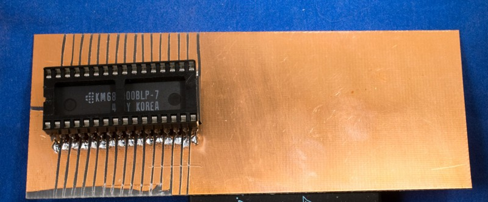

# Tiny302 Prototypes

There are two iterations of the Tiny302 prototypes.
### First prototype iteration
The first iteration was using a surface mounted 68302 removed from a pc board. The RAM and Flash are standard 32-pin through-hole components. The “pc board” is single-sided copper clad board that was scored with a razor blade to create component footprint for RAM Flash. To reduce the number of hand wires, RAM and Flash are “piggy backed” with the Flash on top of the RAM.

The 68302 is glued down upside down so its leads are readily accessible. The ground pins are bent down toward the board and soldered to the copper foil via short wires. The Vcc pins are bent toward the center where a ring is constructed to tie all Vcc together. The number of wires is relatively few due to piggy-back RAM/Flash and 8-bit data bus, but it took a couple evenings to complete due to the delicate soldering.

 of the 1st iteration Tiny302 prototype

When the 1st prototype was build, I had no working schematic creation tool so the “schematic” for the above prototype was 4 sheets of [hand drawn component pinouts](tiny302_prototype1_schematic_hand_drawn.pdf).

### Second prototype iteration

I revived a 20-year old schematic/pcb tool made by IVEX (no longer in business) called WinDraft (schematic) and WinBoard (pc board). Use WinDraft, I created the schematic of the 2nd iteration of prototype board.

schematic of second iteration prototype

2nd iteration prototype board

schematic of EASy68k hardware display

2nd iteration prototype board with EASy68K hardware display incorporated, component side , backside

