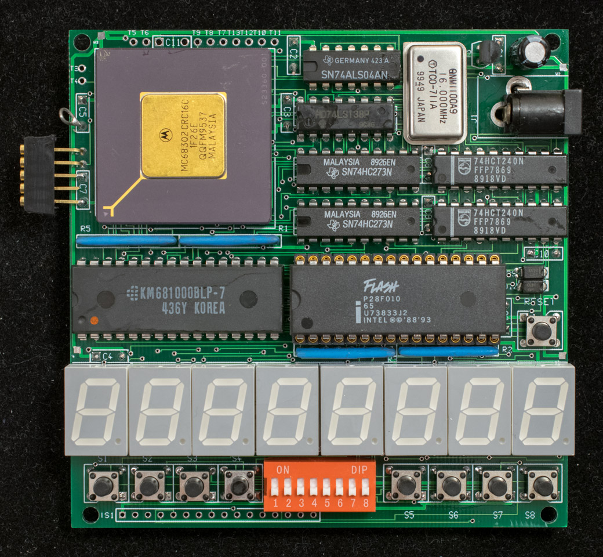

# Tiny302 pc board design

After the successful fabrication of Tiny302 prototype and a working monitor running on the Tiny302 prototype. It is time to put the design in a pc board. To minimize cost, the pc board form factor is 100mm x 100mm. This is a tight board, all components barely fit in the small form factor. The schematic is created with WinDraft, and the board is layout using WinBoard. As a part of the WinBoard package is license & interface to the Specctra autorouter (version 8–this is a 20-year old software, after all). The board is manually placed and then autorouted with the Specctra router in 2-layer. Specctra router is extremely fast, the autoroute is done in less than 5 minutes.

Use the naming convention provided by Seeed Studio, the routed design files are zipped and uploaded to Seeed Studio and proofed using their on-line gerber viewer.

schematic of Tiny302 pcb

design files uploaded to Seeed Studio

bare pc board, component side

bare pc board, solder side

Core components are the minimal set of parts required to boot up Tiny302.

Tiny302 pcb populated with core components, component side
Tiny302 pcb populated with core component, solder side
Fully populated Tiny302 with EASy68k hardware display

Tiny302 part list

